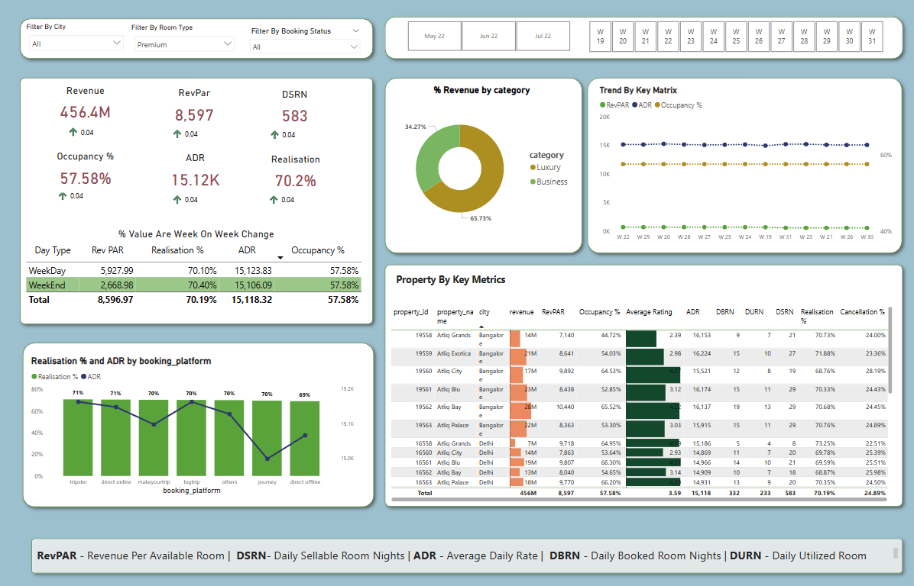

# Hotel Hospitality Dashboard - Power BI Project

## 📌 Project Overview
This project is a **Hotel Hospitality Dashboard** built using **Power BI**, which allows hotel owners to analyze revenue, occupancy, and booking trends efficiently. It integrates multiple datasets to provide insightful visualizations and KPI tracking for better decision-making.

---

## 🏗️ Tech Stack & Tools
- **Power BI** - Data visualization & dashboard creation
- **Power Query** - Data transformation & cleaning
- **DAX (Data Analysis Expressions)** - Custom measures & calculated columns

---

## 📊 Features & Insights
✅ **Revenue Analysis:** Tracks total revenue, RevPAR (Revenue Per Available Room), and realization percentage.  
✅ **Occupancy Metrics:** Displays occupancy rates, ADR (Average Daily Rate), and DSRN (Daily Sellable Room Nights).  
✅ **Booking Trends:** Provides insights into weekday vs. weekend booking patterns.  
✅ **Category-based Revenue:** Compares revenue between **Luxury** and **Business** hotels.  
✅ **Property Metrics:** Analyzes key hotel properties based on revenue, occupancy, and rating.  
✅ **Booking Platform Analysis:** Shows realization % and ADR across various platforms.  
✅ **Cancellation Rate & Trends:** Tracks cancellation rates across different properties.  
✅ **Time-Series Trends:** Weekly revenue and occupancy trends for forecasting.

---

## 📂 Datasets Used
This project is based on 5 CSV files:

1. **dim_date.csv** - Contains date-related information such as week number and day type.
2. **dim_hotels.csv** - Provides hotel property details, including category and city.
3. **dim_rooms.csv** - Defines room types and classifications.
4. **fact_aggregated_bookings.csv** - Includes check-in details and booking success rates.
5. **fact_bookings.csv** - Contains customer booking data, revenue, and booking status.

---

## 🛠️ Data Cleaning & Transformation
- **Date Adjustments:** Re-created `day_type` column to align with industry standards where **Friday & Saturday** are weekends.
- **Header Fixes:** Adjusted column headers for better readability.
- **Merged Datasets:** Integrated fact and dimension tables for a unified view.
- **Calculated Measures:** Created custom DAX formulas for revenue, occupancy, and ADR calculations.

---

## 📌 How to Use This Dashboard?
1. Open **Power BI** and load the dataset.
2. Explore different filters such as **City, Room Type, Booking Status** to get insights.
3. Analyze key trends and metrics through interactive visualizations.

---

## 📷 Dashboard Preview

---

## 🚀 Future Enhancements
- **Real-time data updates** using an API connection.
- **Predictive analytics** for demand forecasting.
- **Interactive drill-through pages** for deeper insights.

---

## 📌 Author
👤 **Gagan Dhanapune**  
📧 [gagandhanapune@gmail.com](mailto:gagandhanapune@gmail.com)  
🔗 [GitHub: @gagan8605](https://github.com/gagan8605)

---

## 🏁 Conclusion
This Power BI project provides hotel owners with valuable insights into their business performance, helping them optimize pricing, improve occupancy, and maximize revenue. 🚀
